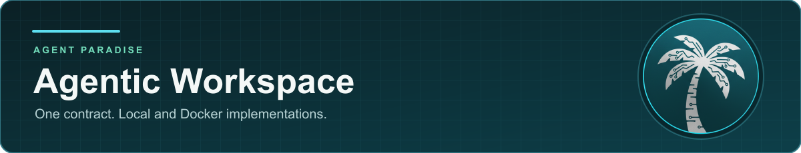

<p align="center"></p>

# Agentic Workspace

[](https://github.com/AgentParadise/agentic-workspace/actions/workflows/ci.yml)
[](LICENSE)
[](#documentation)

Isolated workspaces for running AI coding agents (Claude Code, Codex) behind
one provider-neutral contract.

An orchestrator asks for a workspace, stages context and credentials into it,
runs an agent, and tears it down. This repository defines that contract in
Rust and ships two implementations of it, plus the signed Docker images the
Docker implementation runs. It is being extracted as the workspace layer
for [Syntropic137](https://github.com/syntropic137/syntropic137); Syntropic137
has not cut over to it yet.

[Architecture](#what-is-here) · [Images](#images) · [Documentation](#documentation) · [Develop](#develop)

## What is here

| Part | What it is |
|------|------------|
| `crates/workspace-core` | Provider-neutral types and the workspace port. Compiles against the APSS workspace standard (`EXP-V1-0006`) and delegates manifest validation to it. |
| `crates/workspace-conformance` | Shared functional conformance assertions every implementation runs. |
| `implementations/docker` | The isolated implementation: Rust Docker adapter, image definitions, and host-side tmux drivers. Fails closed on isolation and credential policy. |
| `implementations/local` | Filesystem and process adapter for tests. **Not a security boundary**: it needs explicit opt-in and refuses production mode. |
| `workspace/` | The runtime baked into every image: entrypoint and opt-in capability modules. |
| `lib/python/` | Python compatibility packages for existing consumers. |
| `plugins/` | Frozen Claude plugin snapshot baked into images. See [`plugins/COMPATIBILITY.md`](plugins/COMPATIBILITY.md). |

Other providers (E2B, SBX, VPS) are planned to plug into the same port. They
do not exist yet.

`APSS.yaml`, `apss.lock` and `Cargo.lock` pin the standard version and the
immutable commit it is built from.

## Images

| Image | Published as | Contents |
|-------|--------------|----------|
| `claude-cli` | `ghcr.io/agentparadise/agentic-workspace-claude` | Claude Code CLI with native OpenTelemetry, plus Codex as a delegation target |
| `omni-agent` | `ghcr.io/agentparadise/agentic-workspace-omni-agent` | Claude Code and Codex on the shared capability runtime |
| `toolchain` | `ghcr.io/agentparadise/agentic-workspace-toolchain` | `omni-agent` plus a native toolchain (compiler toolchain, rustup, pnpm, bun) for repositories that compile code |
| `interactive-tmux` | not published | Interactive CLIs in one tmux session, driven from the host |
| `base` | not published | Minimal base image with no agent |

Details and build options: [`implementations/docker/images/README.md`](implementations/docker/images/README.md).

### Using the published images

Images are published only from the protected `release` branch by
[`release-images.yml`](.github/workflows/release-images.yml), as
multi-architecture images (amd64, arm64). Each digest carries a keyless
Sigstore signature plus BuildKit SBOM and provenance attestations.
`toolchain` is built FROM the exact `omni-agent` digest of the same run and
passes a compile smoke test on both architectures before it is signed. There
is no `latest` tag.

1. Pin by digest, never by tag.
2. Verify the signature against the release workflow identity:

   ```bash
   cosign verify \
     --certificate-identity \
       'https://github.com/AgentParadise/agentic-workspace/.github/workflows/release-images.yml@refs/heads/release' \
     --certificate-oidc-issuer https://token.actions.githubusercontent.com \
     ghcr.io/agentparadise/agentic-workspace-omni-agent@sha256:<digest>
   ```

3. Only then promote the digest into your deployment.

Tags, labels and the release procedure are in [`docs/RELEASE.md`](docs/RELEASE.md).

### Building locally

```bash
uv run scripts/build-provider.py claude-cli              # build
uv run scripts/build-provider.py claude-cli --stage-only # stage the build context only
```

## Develop

Requires a Rust toolchain (see `rust-toolchain.toml`), [uv](https://docs.astral.sh/uv/)
for Python, and Docker for the Docker conformance suite.

```bash
cargo fmt --all --check
cargo clippy --workspace --all-targets -- -D warnings
cargo test --workspace
REQUIRE_DOCKER_CONFORMANCE=1 cargo test -p agentic-workspace-docker --test conformance
```

Python packages are tested with `uv run pytest` from each directory under
`lib/python/`.

## Documentation

- [`docs/workspace.md`](docs/workspace.md): what a workspace does and exposes
- [`docs/workspace-capabilities.md`](docs/workspace-capabilities.md): opt-in capability modules
- [`docs/adrs/`](docs/adrs/): design decisions
- [`docs/RELEASE.md`](docs/RELEASE.md): release and image verification
- [APSS declaration](APSS.yaml) and [resolved standard pin](apss.lock)
- [Conformance coverage](tests/conformance/COVERAGE.md) and [known discrepancies](tests/conformance/DISCREPANCIES.md)

## Security

Report vulnerabilities privately, as described in [`SECURITY.md`](SECURITY.md).

## License

[MIT](LICENSE)
